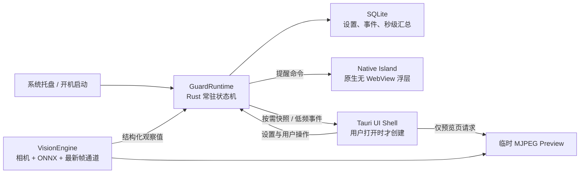

# 健康提醒 · 轻量化最终架构决策 v4.0

状态：**已决定，分阶段迁移**
目标：产品以后台提醒为核心；主界面、趋势页和摄像头预览都不是常驻能力。

## 1. 结论

最终采用 **Rust 常驻运行时 + 按需 Tauri 设置界面 + 原生轻量提醒浮层**：

- Rust 是提醒、计时、视觉观察、SQLite 和生命周期的唯一事实来源。
- 主 WebView 仅在用户主动打开时创建，关闭后销毁，而不是长期隐藏。
- 后台摄像头只产生结构化姿态观察，不启动 MJPEG 预览。
- 灵动岛最终改为原生无 WebView 浮层；迁移期间继续使用独立静态 HTML，禁止加载 React/Tailwind。
- 不在本阶段改写整套主界面，也不引入独立 C++ 进程。

这套方案优先降低用户绝大多数时间所处的“后台状态”成本，而不是只优化短暂打开的页面。

## 2. 证据与边界

### 已确认事实

- 2026-08-09 的调试态采样中，应用进程族工作集约为 **435–457 MB**；Rust 主进程约 **39 MB**。
- WebView2 进程族占主要部分，并存在两个 renderer，采样值分别约 **133 MB** 与 **62 MB**。
- 当前应用恰好存在主窗口与灵动岛两个 WebView。
- 当前视觉管线原先以约 30 FPS 捕获并接近逐帧推理；提醒状态机的判断尺度是秒到分钟。
- 高频 `ingest_observation` 原先每次都会持久化，而后台 1 秒 tick 已经会重复持久化。
- 当前前端负责启动/停止视觉管线并把视觉事件重新通过 IPC 送入 Rust 核心，因此现在不能安全销毁主 WebView。

### 合理推断

- 两个 renderer 很可能分别服务主窗口与灵动岛，但 WebView2 没有在采样数据中直接标注窗口归属，所以不能把单个 renderer 数字当作精确窗口成本。
- Release 构建通常不同于调试态，但在完成相同场景的 Release 对照测试前，不承诺具体内存数值。

### 已实施的低风险优化

- 摄像头预览目标帧率从 30 FPS 调整为 15 FPS。
- MoveNet 推理限制为 5 FPS，只处理最新帧；200ms 粒度远小于现有多秒行为门控。
- 视觉观测只更新内存，SQLite 统一由 1 秒 tick 持久化；用户操作仍同步落盘。
- 灵动岛保持独立静态 HTML，不加载第二套 React/Tailwind。
- 主界面生产 CSS 约 52 KB、JS 主包约 359 KB；包体不是当前常驻内存的主要矛盾。

这些改动主要降低 CPU、功耗、浏览器 JPEG 解码和磁盘写入，**不会被包装成 WebView 内存已显著下降**。

## 3. 最终组件边界

### GuardRuntime

- 独立于任何窗口运行提醒、休息、暂停、静默时段和统计状态机。
- 接收 VisionEngine 的结构化观察值，不通过 React 中转。
- 每秒统一推进与持久化；设置、休息、忽略、延后等用户操作立即持久化。

### VisionEngine

- 使用容量为 1 的“最新帧”通道；旧帧直接覆盖，绝不排队积压。
- 后台模式只做 5 FPS 推理，不创建预览流。
- 校准或用户打开检测预览时才启用 15 FPS MJPEG。
- 暂停、定时模式或权限不可用时释放相机；休息期间只保留低频观察，以确认真实离座/站立。

### Tauri UI Shell

- UI 是状态投影，不负责启动后台事实链路。
- 托盘点击时创建主 WebView；关闭窗口时销毁并释放 renderer。
- 页面只订阅 1 Hz 快照；摄像头关键点叠加可单独限制到 5–10 Hz。

### Native Island

- Windows 顶层无边框窗口，只绘制图标、两行文本和必要按钮。
- 被动详情使用命中测试穿透；只有按钮区域接收鼠标。
- 负责 DPI、多显示器和键盘可访问性；渲染失败时退化到系统通知。

## 4. 运行状态预算

| 状态 | 常驻组件 | 不应存在 |
| --- | --- | --- |
| 后台定时提醒 | Rust Runtime、托盘、SQLite | WebView2、摄像头、ONNX 会话 |
| 后台摄像头提醒 | Runtime、VisionEngine、托盘 | 主 WebView、MJPEG 预览连接 |
| 主界面打开 | Runtime、一个主 WebView | 灵动岛 WebView |
| 校准/预览 | Runtime、主 WebView、VisionEngine、临时 MJPEG | 第二套 React 应用 |
| 提醒展示 | Runtime、原生 Island | 独立 WebView renderer |

绝对内存预算必须在同一台机器、同一 Release 构建和同一静置时间下确定。现阶段采用结构性验收：

- 后台定时模式没有 `msedgewebview2` 子进程。
- 后台摄像头模式没有 MJPEG 客户端，推理不超过 5 FPS。
- 主窗口关闭后 renderer 能被释放，而不是仅变为不可见。
- 数据库周期性写入不超过 1 Hz，用户动作除外。
- 迁移前后提醒时序、离座判断和休息完成语义保持一致。

## 5. 迁移顺序

### Phase A：当前低风险优化（已完成）

- 主页面紧凑布局与无滚动适配。
- 15 FPS 捕获、5 FPS 推理。
- 视觉观测写入合并到 1 秒持久化。
- 静态轻量灵动岛与 Tailwind 主界面分离。

### Phase B：后台事实链路迁入 Rust

1. VisionEngine 将 `VisionObservation` 直接发送给 GuardRuntime。
2. 删除生产环境中的“视觉事件 → React → ingest IPC”回路。
3. React 只收低频快照和可选关键点事件。
4. 增加无窗口运行集成测试，覆盖提醒、离座、休息与暂停。

这是后续所有内存优化的前置条件，不能跳过。

### Phase C：主 WebView 按需生命周期

1. 关闭主窗口时销毁 WebView。
2. 托盘、单实例启动和提醒操作需要主页时重新创建窗口。
3. 重新创建后从 Rust 快照恢复页面，不依赖旧 React 内存。
4. 对比“窗口隐藏”和“窗口销毁”两组 Release 进程数据。

### Phase D：原生灵动岛

1. 先保留现有静态 HTML 浮层作为功能基准。
2. 实现原生绘制与按钮命中测试。
3. 完成多屏、缩放、任务栏位置、键盘与高对比度回归后移除第二 WebView。

### Phase E：Release 资源验收

- 分别测量后台定时、后台摄像头、主界面、校准、提醒五个场景。
- 每个场景预热并静置 5 分钟，记录工作集、私有字节、CPU、GPU 和数据库写入频率。
- 与同机迁移前 Release 基线比较，不将 Debug 数值作为上线承诺。

## 6. 未选择的方案

### 立即重写为全原生 UI

不采用。它会显著提高表单、趋势图、无障碍和迭代成本；只要 WebView 按需创建，就不会影响后台常驻成本。是否重写应由 Phase E 的数据决定。

### 独立 C++ Vision Worker

当前不采用。额外进程会增加内存、部署和故障恢复复杂度。只有 ONNX Runtime 稳定性、硬件加速或进程隔离出现明确证据时再拆分。

### 继续保留两个常驻 WebView

不采用。它实现简单，但与“用户绝大多数时间不看界面”的产品定位相冲突。

## 7. 主要风险

- Phase B 迁移期间若前后端同时 ingest，会造成重复计时；必须以特性开关保证只有一个写入者。
- 未完成 Phase B 就销毁主 WebView，会停止当前摄像头管线，这是禁止的迁移顺序。
- 5 FPS 需要用可重复的测试片段验证短时遮挡和快速离座；若有回归，应优先调整状态门控，不直接恢复 30 FPS。
- 原生浮层必须单独处理 DPI、多显示器与命中测试，不能只在主显示器验证。

## 8. 最终决策

健康提醒不会追求“任何情况下都只有几十 MB”这种未经测量的口号。最终目标是：**后台定时状态接近普通原生托盘程序，摄像头状态把资源花在低频视觉判断上，WebView 只在用户主动查看时付费。**

## 9. 外部只读能力：天气

天气是主 WebView 打开时的按需读模型，不属于 GuardRuntime、提醒状态机或 SQLite 健康数据：

- React 天气功能层调用 Open-Meteo，并以运行时 schema 校验城市搜索和预报响应；不读取设备位置。
- 城市偏好和短期预报缓存在 WebView localStorage；关闭主窗口后不轮询、不保留定时器。
- CSP 只允许连接 Open-Meteo 天气与地理编码两个 HTTPS 域名。
- 单个地点失败不影响其他地点，也不会导致健康监测进入 degraded 状态。
- 如果未来需要后台天气提醒、跨设备同步或统一供应商配额，再把调度、凭据和持久化迁入 Rust/服务端；当前阶段不预先引入这些复杂度。

完整决策和接口契约见 [天气功能架构设计](WEATHER_ARCHITECTURE.md)。
