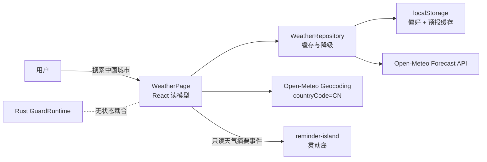

# 天气功能架构设计 v1.0

状态：**已实现，可进入桌面端联调**  
适用版本：健康提醒 v0.1.x  
核验日期：2026-08-11

## 1. 架构结论

天气采用 **React 按需读模型 + Open-Meteo 适配器 + localStorage 短期缓存**，不进入 Rust 健康状态机和 SQLite，也不读取设备位置。

这是当前阶段最小且边界清晰的实现：天气只在用户打开页面时产生价值，不需要后台常驻；外部服务异常不能影响久坐/低头提醒；城市偏好在主 WebView 销毁、重建后仍可恢复。



## 2. 事实、推断与假设

### 已确认事实

- 项目是 React 19 + TypeScript strict + Tauri 2 + Rust + SQLite；Rust 是健康监测与提醒的唯一事实来源。
- 最终架构要求主 WebView 按需创建，关闭后释放；天气不应阻止这一路线。
- Open-Meteo 地理编码接口支持 `name`、`language`、`countryCode`、`feature_code` 与 `population`；当前实现使用 `language=zh&countryCode=CN&count=12`，只保留行政中心或人口不少于 5 万的聚居地。
- Forecast API 可按经纬度返回当前温度、体感温度、湿度、云量、紫外线、降水、WMO 天气代码、风速以及逐日预报，`timezone=auto` 返回地点本地时间。
- Open-Meteo Free / Open-Access 条款当前限定非商业使用，限制少于 10,000 次/日、5,000 次/小时、600 次/分钟；API 数据按 CC BY 4.0 使用并要求署名。
- 已用杭州坐标做真实接口联调，中文同名城市候选、`Asia/Shanghai` 时区和 5 日预报均符合当前解析契约。

官方依据：[Forecast API](https://open-meteo.com/en/docs)、[Geocoding API](https://open-meteo.com/en/docs/geocoding-api)、[Terms](https://open-meteo.com/en/terms)、[Licence](https://open-meteo.com/en/license)。

### 推断

- 天气展示不是健康提醒的关键链路，因此允许“最终一致”和短时旧数据，比引入后台调度与数据库迁移更合适。
- 每地点独立请求比批量坐标请求多一些调用，但能获得更简单的缓存键、局部重试和故障隔离；最多 8 个地点使开销仍可控。
- 城市由用户搜索并明确选择。Windows、浏览器和网络 IP 定位均不接入，避免桌面设备缺少 GPS、Wi-Fi 断开或代理/VPN 出口导致的错误城市。

### 当前产品假设

- v0.1.x 是符合 Open-Meteo Free / Open-Access 条款的非商业版本。若该假设不成立，不得直接上线当前免费端点。
- 天气页不申请位置权限；只保存用户明确选择的城市及 Open-Meteo 返回的城市坐标。
- 天气只提供生活参考，不做诊断，不自动改变久坐阈值、提醒级别或休息完成逻辑。

## 3. 范围

### 已实现

- 中国城市模糊搜索、行政中心过滤与同名村镇排除。
- 最多 8 个地点，支持新增、删除和独立刷新。
- 当前温度、体感温度、湿度、云量、紫外线、风力、降水量/概率、WMO 天气状态和 5 日预报。
- 首选地点天气在今日概览、休息页和灵动岛复用；天气详情采用单屏主从布局，多地点不再纵向堆叠。
- 基于天气的非医疗活动建议，例如高降水时建议室内走动。
- 15 分钟新鲜缓存；网络失败时回退到不超过 6 小时的旧缓存，并明确标注。
- Open-Meteo / CC BY 4.0 页面署名。

### 明确不做

- 后台天气轮询、天气系统通知和基于天气自动改提醒策略。
- GPS、Wi-Fi、IP 或系统默认位置定位，以及精确地址和轨迹。
- 空气质量、灾害预警、分钟级降水、历史天气与地图。
- 商业 SLA、多供应商自动切换和服务端代理。

## 4. 组件边界

| 组件 | 责任 | 不负责 |
| --- | --- | --- |
| `WeatherPage.tsx` | 搜索交互、每地点加载状态、视图组合 | 外部 JSON 可信度、持久化细节 |
| `openMeteo.ts` | URL 构造、城市结果排序、8 秒超时、Zod 校验、DTO 映射、WMO 文案 | UI 状态、长期缓存 |
| `repository.ts` | 地点偏好、TTL、旧数据降级、同地点请求合并 | 健康 SQLite、后台任务 |
| `usePrimaryWeather.ts` | 读取首选地点并向概览、休息页、灵动岛发布同一摘要 | 健康提醒决策 |
| `types.ts` | 天气领域类型和缓存常量 | Open-Meteo 原始字段 |
| Tauri CSP | 仅放行两个 Open-Meteo 源 | 通配网络访问 |

外部响应先经过 Zod，再转换为内部 camelCase 类型。页面不依赖供应商的 snake_case DTO，未来更换供应商时主要改动适配器和许可证呈现。

## 5. 外部接口契约

### 城市搜索

```http
GET https://geocoding-api.open-meteo.com/v1/search
  ?name={用户关键词}
  &count=12
  &language=zh
  &format=json
  &countryCode=CN
```

保存字段：GeoNames id、名称、省级行政区、国家、WGS84 经纬度和 IANA 时区。候选结果使用 `feature_code` 与 `population` 做城市级过滤和排序；GeoNames id 形成稳定地点键 `city:{id}`，避免同名城市冲突。

### 天气预报

```http
GET https://api.open-meteo.com/v1/forecast
  ?latitude={lat}
  &longitude={lon}
  &current=temperature_2m,apparent_temperature,relative_humidity_2m,
           precipitation,cloud_cover,uv_index,weather_code,
           wind_speed_10m,wind_gusts_10m,is_day
  &daily=weather_code,temperature_2m_max,temperature_2m_min,
         apparent_temperature_max,precipitation_probability_max,
         precipitation_sum,uv_index_max,sunrise,sunset
  &timezone=auto
  &forecast_days=5
```

当前请求不带 API Key。商业端点需要不同主机名/凭据，届时凭据不能放在 WebView；应迁到受控服务端或评估自托管。

## 6. 数据与缓存

| 键 | 内容 | 生命周期 |
| --- | --- | --- |
| `cervical-guard-weather-locations-v1` | 最多 8 个地点偏好 | 用户删除前保留 |
| `cervical-guard-weather-preferred-v1` | 概览、休息页与灵动岛共用的首选地点 id | 用户切换前保留 |
| `cervical-guard-weather-cache-v2` | 按地点 id 保存的内部预报 DTO | 新鲜 15 分钟，降级最多使用 6 小时 |

读取算法：

1. 15 分钟内的有效缓存直接返回，不访问网络。
2. 缓存过期时请求 Open-Meteo；同一地点的普通并发请求复用同一个 Promise。
3. 请求成功后原子替换该地点缓存。
4. 请求失败且旧缓存不超过 6 小时时返回 `stale=true`；否则显示该卡片错误。
5. 删除地点时同步删除该地点缓存。

localStorage 失败只影响天气偏好持久化，不会升级为全局应用错误，更不会改变 GuardRuntime 生命周期。

## 7. 可用性、限流与性能

- 页面挂载时只请求缺失/过期地点，没有定时轮询；窗口关闭后零天气任务。
- 最多 8 个地点，单地点独立失败和重试；刷新按钮在请求期间禁用，同地点 60 秒内的重复手动刷新直接复用缓存。
- 8 秒超时，解析失败、HTTP 失败和网络失败均转为用户可理解的卡片级错误。
- 正常情况下，即使用户每 15 分钟重新进入页面并刷新全部地点，单设备约 768 次天气请求/日；城市搜索另计。该估算低于当前免费日限额，但共享出口 IP、多设备和用户手动高频刷新仍可能叠加，不能视作服务保证。
- 若进入公测或组织部署，应增加跨设备用量观测、指数退避和供应商配额告警；不得采集用户精确坐标作为遥测维度。

## 8. 隐私与安全

- 摄像头、姿态关键点和健康统计绝不发送给天气供应商。
- 城市搜索会发送用户输入的城市关键词；选择城市后，其公开行政中心坐标会发送给 Open-Meteo 获取天气。
- 不申请或读取系统位置权限，不进行 GPS、Wi-Fi 或 IP 定位。
- CSP `connect-src` 精确放行 `https://api.open-meteo.com` 和 `https://geocoding-api.open-meteo.com`，不使用 `https:*` 通配。
- 页面固定展示数据来源和 CC BY 4.0 署名；第三方声明同步记录许可证与商业化复核要求。
- 天气是外部模型预报，活动文案必须保持建议性质，不表达医疗结论或恶劣天气安全保证。

## 9. 失败模型

| 故障 | 用户体验 | 健康核心影响 |
| --- | --- | --- |
| 无网络 / DNS / 超时 | 单卡旧数据或重试提示 | 无 |
| 单城市响应异常 | 仅该城市失败 | 无 |
| Zod 校验失败 | 拒绝错误 DTO，显示失败 | 无 |
| localStorage 不可用 | 当前会话可用，重启后偏好不保留 | 无 |
| Open-Meteo 限流 | 保留 6 小时内旧数据 | 无 |

## 10. 商业化和演进门槛

出现以下任一条件时，应把天气访问迁到 Rust 或服务端 BFF，而不是继续扩张当前 WebView 客户端：

- 商业发行，需要付费 API 凭据或稳定 SLA。
- 需要后台天气提醒、计划任务、跨设备同步或统一配额。
- 需要双供应商降级、审计、集中缓存或地域合规策略。
- 需要将天气作为健康策略输入；此时必须单独进行产品安全评审，建立可解释规则和关闭开关。

推荐演进顺序：先抽象 `WeatherProvider` 契约并加入服务端缓存，再迁移凭据和配额控制，最后才考虑后台调度。当前代码已经用内部 DTO 隔离供应商字段，但没有为了未来需求预先引入接口类和依赖注入容器。

## 11. 验收清单

- [x] 中文搜索只返回 `countryCode=CN` 的城市级结果；“南京”只保留江苏行政中心，排除云南同名村镇。
- [x] 可保存多个地点并在 WebView 重建后恢复，超过 8 个时明确拒绝。
- [x] 仅支持用户搜索并明确选择城市，不读取设备位置。
- [x] 当前值和 5 日数组经过运行时 schema 校验。
- [x] 15 分钟缓存和 6 小时旧数据降级不影响健康状态机。
- [x] CSP 只增加两个 Open-Meteo 指定域名。
- [x] 页面与第三方声明包含 Open-Meteo / CC BY 4.0 署名。
- [x] WMO 映射与活动建议有单元测试。
- [ ] 商业发布前完成 Open-Meteo 套餐、GeoNames 署名和隐私政策复核。
